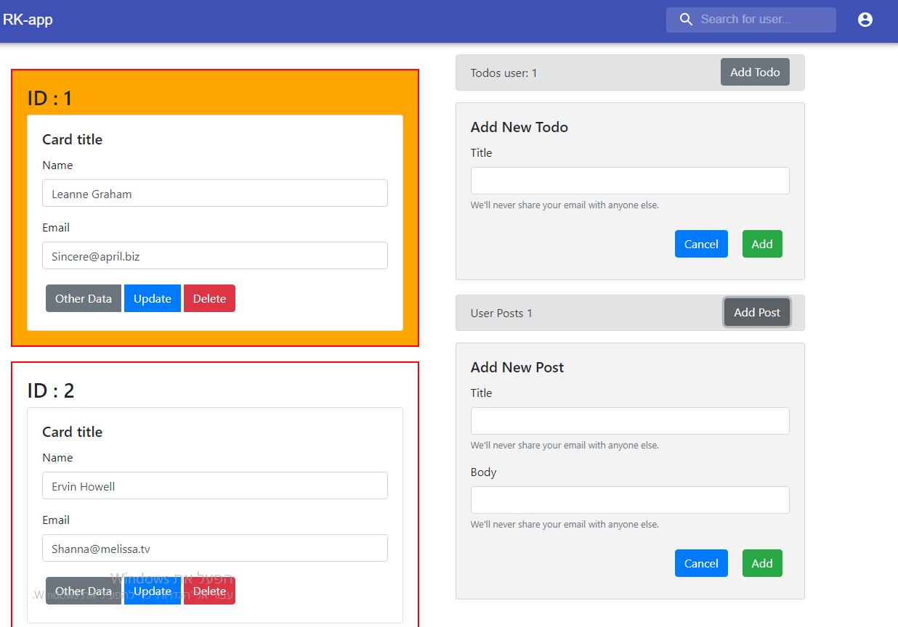

# React Middle Project

> Project based on react with react HOOKS

## Available Scripts

### `npm start`

Runs the app in port 3000

<<<<<<< HEAD
### npm build

Build the app for production to `build` folder.
=======
### `npm build`

Build the app for production to `build` folder.
>>>>>>> fb06af183fcfab827a07400bb1cd4eeba5d875ac
